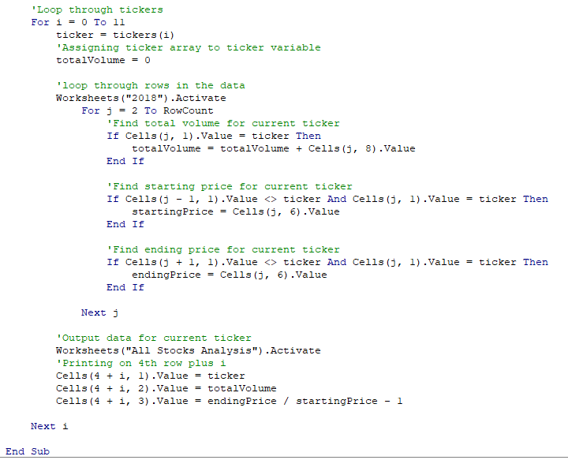
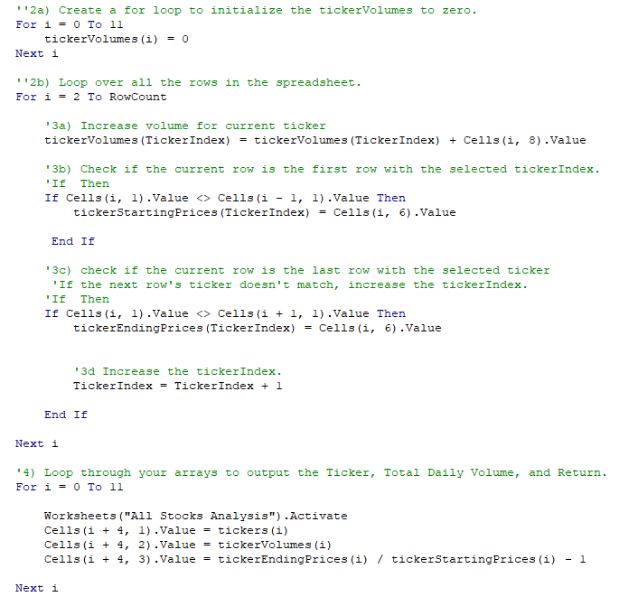

# Stocks Analysis with VBA and Excel
Using the `green_stocks` document, we will analyze the stocks of companies compared to  **DAQO** stocks using **VBA** inside Excel to automate tasks such as making calculations and using complex logic to  perform analyses.

## Overview of Project
Using a dataset that included two years, 2017 and 2018, VBA code was written inside Excel's Developer options to calculate the total daily volume and rate of return for each stock in either year. The VBA code was then refactored to make the data more efficient and easier to understand.

## Results 

### Original VBA Code
Below is the original VBA code that included two loops:

After this code was executed against the 2017 data, the timer states the analysis ran in 0.754 seconds.

After this code was executed against the 2018 data, the time states the analysis ran in 0.770 seconds.

### Refactored VBA Code
Below is the refactored VBA code that included the same two loops but refractored into a condensed version:

After this code was executed against the 2017 data, the timer states the analysis ran in 0.176 seconds.

After this code was executed against the 2018 data, the time states the analysis ran in 0.176 seconds.

## Summary
### The advantages of refactored code:
1. Improved speed of program.
2. Cleaner code that is easier to read.
3. Less potential for errors since there is less code involved.

### The disadvantages of refactored code:
1. Coding is more complicated, developer of code must understand the content.
2. Refactoring code takes more time and concentration to not compromise the code.

### How the pros and cons apply to refactoring the original VBA script:
1. The execution time of the analysis was improved.
2. The code was cleaner and easier to read.
3. The refactoring of the code took more time to get to work correctly, but overall it seemed to be worth it with how much the time the analysis ran improved.
